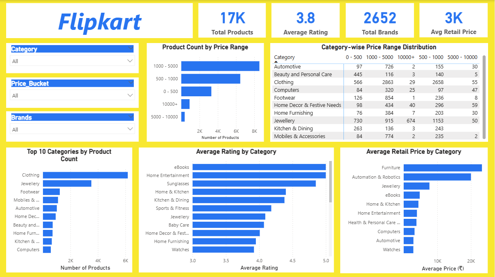

# Flipkart Product Analysis Dashboard

An interactive dashboard analyzing Flipkart product listings to understand pricing distribution, category performance, and customer satisfaction trends across the platform.

## Overview

This project presents a comprehensive analysis of Flipkart product listings using Power BI. The dashboard transforms raw product data into actionable insights, helping explore how pricing, product categories, brands, and customer ratings are distributed across the marketplace.

The objective of this project is to demonstrate how business intelligence tools can be used to analyze large e-commerce datasets and uncover patterns related to product pricing, category dominance, and customer satisfaction.

## Dashboard Preview



## Key Metrics

The dashboard summarizes core marketplace indicators that provide a quick overview of product availability, pricing trends, and brand presence.

| Metric                     | Value    |
| -------------------------- | -------- |
| **Total Products Listed**  | **17K**  |
| **Average Product Rating** | **3.8**  |
| **Total Brands**           | **2652** |
| **Average Retail Price**   | **₹3K**  |

These metrics provide a high-level snapshot of Flipkart's product ecosystem, highlighting the scale of listings and general customer satisfaction levels.

## Business Questions Answered

The dashboard helps explore several important analytical questions:

* Which product categories contain the highest number of listings?
* How are products distributed across different price ranges?
* Which categories receive the highest customer ratings?
* Which product categories have the highest average retail price?
* How do pricing patterns vary across categories and price buckets?
* Which brands and categories dominate the marketplace?

## Key Insights

Analysis of the dataset reveals several notable patterns within the Flipkart marketplace:

* The **₹1000–₹5000 price range contains the highest concentration of products**, indicating strong mid-range market dominance.
* **Clothing has the largest number of product listings**, making it the most competitive category on the platform.
* Premium categories such as **Furniture and Automation & Robotics have significantly higher average retail prices** compared to other categories.
* Categories like **E-books and Home Entertainment show strong customer ratings**, despite having fewer product listings.
* A large number of categories maintain **average ratings between 3.5 and 4.5**, suggesting moderate overall customer satisfaction.

## Dashboard Features

The dashboard includes several interactive components designed to enable deeper exploration of the data:

* Category-level filtering to analyze product distribution
* Price bucket segmentation to study pricing patterns
* Brand-level filtering to evaluate product presence across brands
* Price range distribution of products across categories
* Category-wise average rating comparison
* Category-wise average retail price analysis
* Top categories by product count

## Dataset Information

The dataset used in this project contains Flipkart product listing data sourced from Kaggle.

* Records analyzed: 19,602
* Columns: 15
* Data Type: E-commerce product listings

The dataset includes information such as product category, brand, retail price, discounted price, and customer rating.

## Data Preparation

Several preprocessing steps were performed to ensure data quality and consistency before building the dashboard:

* Removed duplicate records
* Handled missing values in retail price fields
* Replaced missing brand values with "Unknown"
* Structured category hierarchy into multiple levels
* Converted rating values into numeric format
* Created price bucket segmentation for analysis
* Built DAX measures for KPI calculations

## Tools and Technologies

This project was developed using the following tools and techniques:

* Power BI
* Power Query
* DAX
* Data Cleaning and Transformation
* Data Visualization

## Project Structure

```
flipkart-product-analysis
│
├── flipkart-product-analysis.pbix
├── dashboard-overview-flipkart.png
└── README.md
```
## How to Use the Dashboard

Download the Power BI file from this repository.

Open **flipkart-product-analysis.pbix** in Microsoft Power BI Desktop.

Use the filters on the left side of the dashboard to analyze the data by:

Category
Price Bucket
Brands

All charts and metrics update automatically based on the selected filters.

## Author

Kirti Sharma


